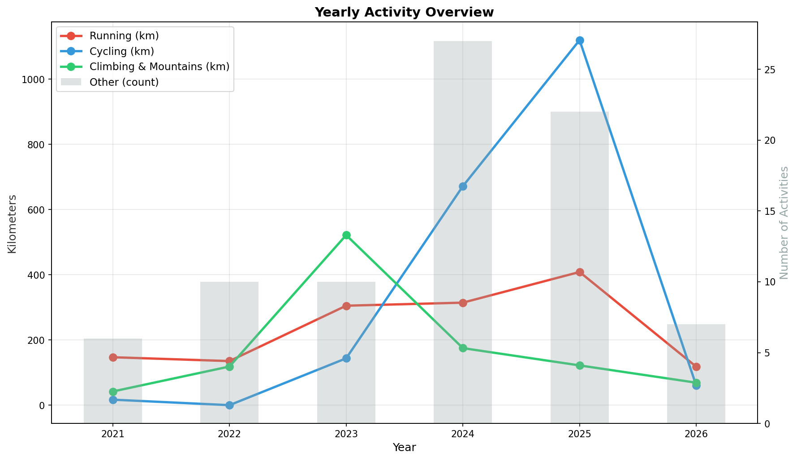

I pulled all my activity data from [Intervals.icu](https://intervals.icu/) and visualized it. Here's how my training has evolved over the past five years.

## The Chart

The chart tracks four categories:

- **Running** — all running activities
- **Cycling** — road, mountain bike, and virtual rides
- **Climbing & Mountains** — hiking, alpine skiing, rock climbing
- **Other** — HIIT, swimming, kayaking, weight training, yoga, and more (shown as activity count)

## What Stands Out

**Cycling exploded.** From 17 km in 2021 to over 1,100 km in 2025. That's a proper transformation.

**Running is steady and growing.** Consistent progress year after year, now north of 400 km annually.

**Climbing & Mountains** peaked in 2023 with a Lofoten Islands crossing, then settled into a solid rhythm.

**Overall:** I'm getting more active every year. 2024 and 2025 were the biggest years yet — and 2026 is just getting started.
