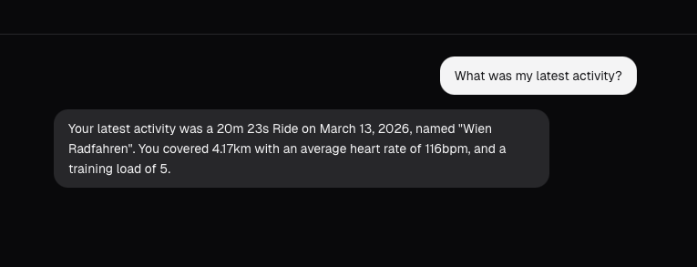
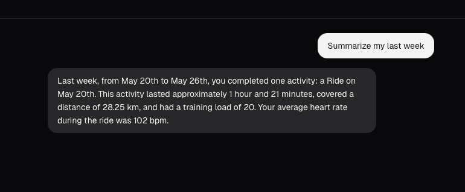

I love [intervals.icu](https://intervals.icu/). It's where all my running, cycling, and climbing data lives. But every time I wanted to answer a question like *"How did my long runs compare this month vs. last month?"* or *"What's my average cycling TSS on weekdays?"*, I'd end up clicking through charts, filtering date ranges, and mentally piecing together an answer. The data was all there — I just couldn't *talk* to it.

So I built a thing that lets me do exactly that.

## Why I Built This

Intervals.icu is excellent for logging and visualizing training data. But querying patterns across workouts — comparing weeks, spotting trends, correlating load with performance — is still a manual process. You know the drill: open the calendar, scroll back, squint at numbers, maybe export a CSV.

I wanted to just *ask*. In plain language.

Now, Intervals Copilot happens to run locally — your data stays on your machine. But I'm not going to pretend I have a strong opinion about that. I use cloud services all the time. Claude is probably my most-used tool at this point. I'm not the guy who thinks everyone should build their own NAS just because they saw it on YouTube.

That said — there's this quote from the German podcast host Tommi Schmidt that stuck with me: *"Spotify has successfully made me pay 10 euros a month to listen to the same 10 songs I've been listening to for the last 10 years."* And honestly, that's kind of the vibe. Sometimes the cost of opting out of a service is lower than you think, and it's at least worth considering where your data goes and what you're paying for. Not as a dogma, just as a thought.

## What It Does

You open the chat interface and ask questions about your training in natural language. The AI has full context of your intervals.icu data and responds with structured answers.

A few examples of what you can ask:

- *"What was my total running distance last week vs. the week before?"*
- *"Show me my cycling fitness trend over the last 3 months."*
- *"Which workouts had the highest Training Stress Score this year?"*

The summary gives you a quick overview of your key training metrics at a glance.

## How It Works

The architecture is straightforward. Your training data flows from intervals.icu through a FastAPI backend that enriches the query with context, sends it to an LLM, and returns structured responses to a Next.js frontend.

graph LR
    A[intervals.icu API] -->|Training Data| B[FastAPI Backend]
    B -->|Context + Query| C{LLM Provider}
    C -->|Nvidia NIM| D[Response]
    C -->|Google Gemini| D
    B -->|Structured Response| E[Next.js Frontend]
    E -->|Natural Language Query| B
    E -->|Chat UI| F[You]

<noscript>
<pre>
intervals.icu API  -->  FastAPI Backend  -->  LLM Provider (NIM / Gemini)
                             |                        |
                             +--- Structured Response -+
                             |
                        Next.js Frontend  -->  You
</pre>
</noscript>

**The stack:**

- **Backend:** FastAPI (Python 3.12+) — handles intervals.icu API calls, builds context for the LLM, and serves structured responses
- **Frontend:** Next.js 15 (Node 22+) — chat UI and dashboard
- **LLM:** Your choice of Nvidia NIM (Kimi K2.5) or Google Gemini
- **Infrastructure:** Docker Compose ties it all together

## Fork It and Build Your Own

This is the part I care about most. **Intervals Copilot is meant to be forked.**

The whole point is that anyone with an intervals.icu account can spin this up, point it at their own data, and start chatting with their training history. The setup is minimal:

1. Clone the repo
2. Add your intervals.icu API key and athlete ID
3. Pick your LLM provider and add the API key
4. Run `docker compose up`

That's it. You're talking to your training data.

The code is intentionally simple and hackable. Want to add a new LLM provider? Swap out a single module. Want to change how context is built? It's one file. Want to add new visualizations to the dashboard? The frontend is standard Next.js.

**GitHub: [github.com/bohniti/intervals-copilot](https://github.com/bohniti/intervals-copilot)**

## What's Next: The Climbers Journal

I'm taking the same pattern and applying it to climbing data. The Climbers Journal will let you chat with your climbing history — routes, grades, progression, projects — the same way Intervals Copilot lets you chat with training data.

If you've seen my [climbing routes post](/blog/2026-03-05-climbing-routes/), you know I've been collecting and visualizing this data for a while. The Climbers Journal is the next step: making that data conversational.

## Go Build Something

If you train with intervals.icu, give [Intervals Copilot](https://github.com/bohniti/intervals-copilot) a try. Fork it, break it, make it yours. And if you build something cool on top of it, I'd love to hear about it.

Find me on [GitHub](https://github.com/bohniti).
