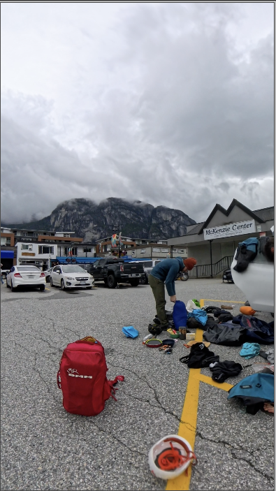
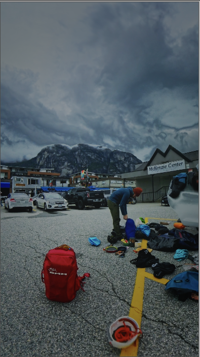

I've wanted to get into video editing for a while, but there was always something more urgent. That changed when I went on a climbing trip to Squamish with a friend in June 2025. I had just bought an Insta360 X4 in the US, and I made a promise to myself: *this time, I'm actually going to make something out of the footage.* It's now March 2026 — nine months later — but the reel is done, and I learned more than I expected along the way.

This post is partly a story and partly a reference for future me. Next time I sit down to edit, I want to be able to come back here instead of starting from scratch.

<blockquote class="instagram-media" data-instgrm-captioned data-instgrm-permalink="https://www.instagram.com/reel/DWWQEaJDNQ_/" data-instgrm-version="14" style="background:#FFF; border:0; border-radius:3px; box-shadow:0 0 1px 0 rgba(0,0,0,0.5),0 1px 10px 0 rgba(0,0,0,0.15); margin: 1.5em auto; max-width:540px; min-width:326px; padding:0; width:99.375%;">

<a href="https://www.instagram.com/reel/DWWQEaJDNQ_/" style="background:#FFFFFF; line-height:0; padding:0; text-align:center; text-decoration:none; width:100%;" target="_blank">View this reel on Instagram</a>

</blockquote>

## Step 1: The "Just Jump In" Approach (Don't Do This)

My first attempt was exactly what you'd expect from someone who has no plan. I loaded all 80 clips into Insta360 Studio and started cutting, keyframing, and tweaking things at random. No structure, no storyline, no selection criteria — just vibes.

The result felt exactly like that: random. Scenes jumped from one thing to the next with no rhythm or purpose. It looked like a slideshow with transitions, not a story.

## Step 2: Watch Everything, Write Everything Down

This is where I turned to Claude (Opus) for guidance. Instead of editing, it suggested I should go back to basics: watch every single clip and manually catalog the good parts. It sounds tedious, but it turned out to be one of the most valuable steps in the whole process.

Claude provided a spreadsheet template with columns for clip number, timestamp, description, category (nature, friendship, climbing, action), and a 1–3 star rating. The target was to select 30–40 scenes, each between 3 and 15 seconds long.

Here's the template structure I used:

| Clip | Timestamp | Description | Category | Stars | Duration |
|------|-----------|-------------|----------|-------|----------|
| 001 | 0:42–0:51 | Approach through forest, morning light | Nature | ⭐⭐⭐ | 9s |
| 003 | 1:15–1:22 | First moves on granite slab | Climbing | ⭐⭐ | 7s |
| 007 | 0:30–0:38 | Laughing at the belay station | Friendship | ⭐⭐⭐ | 8s |

I'll admit, the amount of watch time had me questioning the approach. But once I started, something nice happened: I got emotionally reconnected with the trip. The early footage brought back memories I'd almost forgotten. It wasn't boring — it felt more like revisiting a journal than doing homework.

That emotional connection faded as the process became more technical, which is actually a good sign. Eventually I was looking at the clips like a cook who has made carbonara a hundred times that week — it stops being food and starts being material. That detachment is useful when you need to make cold editing decisions.

## Step 3: Choosing the Tech Stack

After cataloging, I researched tools on Reddit and discussed options with Claude. Two key decisions:

**Editing software: DaVinci Resolve.** It's free, it's professional-grade, and it has the best color grading tools in the business. I knew going in that it would have the steepest learning curve, but I wanted to learn it properly rather than hit a ceiling with simpler tools.

**Reframing: Insta360 Studio.** Since I was shooting 360° footage with the X4, I needed to reframe (set keyframes for the "virtual camera") before bringing clips into Resolve. Doing the keyframing in Insta360 Studio also helped me flatten the learning curve — I could handle one complexity at a time instead of learning reframing and editing simultaneously.

## Step 4: Building the Storyline

With the keyframed footage ready, I put together a rough cut following a storyline Claude had drafted. I wasn't fully convinced by it, but I also wasn't sure enough in my own instincts yet to override it.

So I did what any reasonable person would do — I showed it to my girlfriend.

The feedback was devastating and exactly what I needed. In her words: there was no storyline. The clips were good individually, but they didn't tell a story together. She was right.

After sitting with it and rethinking the structure, I came up with an order I actually liked. The lesson here is clear: AI can help you organize and suggest, but *you still have to think.* The creative judgment — what feels right, what connects emotionally — that's still yours.

## Step 5: Color Grading in DaVinci Resolve

Color grading became its own rabbit hole. After working through the resources below and a lot of trial and error, I converged on a fixed five-node chain that I now reuse for every project. The structure stays the same shot to shot — only the values change.

Resources that mattered most:

- [Basic Color Correction in DaVinci Resolve](https://youtu.be/QB_GKc6LqIM?si=gWgKliSivFnGr8NS) — solid starting point for beginners
- [DaVinci Resolve Color Grading Playlist](https://www.youtube.com/watch?v=J1aU-zZ6ACs&list=PLanQgfsci7riIwjUdJ2UxqDBZAsaHT18d) — in-depth series on nodes, scopes, and grading workflows
- [Color Transform & LUT Workflow](https://youtu.be/g8cdK8pci40?si=M5RpnE6oN8k42aII) — how to chain transforms correctly

### My DaVinci Resolve Node Template

The chain runs left to right. Each node has one job. The order matters — input transforms before creative grading, creative grading before output transforms.


graph LR
  N1["Node 1 Primary Correction Lift / Gamma / Gain"] --> N2["Node 2 Input CST Rec.709 input"]
  N2 --> N3["Node 3 Creative LUT Fuji emulation"]
  N3 --> N4["Node 4 Output CST Rec.709 output"]
  N4 --> N5["Node 5 Final Adjustments Saturation / Contrast / Vignette"]


#### Node 1: Primary Correction

Fix exposure and white balance before any creative move. This is where the footage becomes neutral.

| Parameter | Range | Tip |
|-----------|-------|-----|
| Lift | -0.02 to 0.00 | Slightly crush blacks for a cinematic feel — don't push past -0.05 or shadows go muddy. |
| Gamma | 0.98–1.02 | Small moves only; >1.05 flattens midtones into milky grey. |
| Gain | 1.00–1.10 | Lift highlights gently; check the waveform stays under 100 to avoid clipping skies. |
| White Balance | Match scene temp | Neutral whites should read close to (1.00, 1.00, 1.00) on the parade scope; a warm cast on snow means you've gone too far. |

#### Node 2: Color Space Transform (Input)

Normalizes the camera's color space to a known starting point. Skip this and your LUT will look different on every clip.

| Parameter | Range | Tip |
|-----------|-------|-----|
| Input Color Space | Match camera profile (Rec.709 for X4 Standard, LOG for Flat) | If the picture goes washed-out and grey-flat after this node, you set Input to Rec.709 on LOG footage — switch to the LOG profile. |
| Input Gamma | Rec.709 (or matching LOG curve) | Should pair with the Color Space above; mismatched gamma produces unrealistic contrast. |

#### Node 3: Creative LUT

The look. Apply your LUT here — never on the raw footage and never after the output transform.

| Parameter | Range | Tip |
|-----------|-------|-----|
| LUT | Fuji film emulation (or matching mood) | Pick a LUT that matches the scene mood, not just one you saw on YouTube — a warm LUT on overcast climbing footage looks fake. |
| LUT Intensity | 0.5–0.7 | Full strength almost always looks overdone; if you can name the LUT just by looking, you went too far. |

#### Node 4: Color Space Transform (Output)

Converts back to the delivery color space. Required for correct color on the final export.

| Parameter | Range | Tip |
|-----------|-------|-----|
| Output Color Space | Rec.709 (for web/Instagram delivery) | If skies look magenta or skin looks green in the export but fine in Resolve, this node is missing or misconfigured. |
| Output Gamma | Rec.709 | Matches the output color space; avoid mixing 2.2 / 2.4 unless you know your delivery target needs it. |

#### Node 5: Final Adjustments

Last-mile polish. Use this for shot-specific tweaks without disturbing the chain above.

| Parameter | Range | Tip |
|-----------|-------|-----|
| Saturation | 45–55 | Less is more, especially over a creative LUT — saturated reds in skin tones are the first sign you've over-pushed. |
| Contrast | 1.00–1.15 | Add punch without clipping; check the waveform isn't slamming the top or bottom rails. |
| Vignette | Subtle if at all | A heavy vignette on 9:16 reels reads as filter, not cinema — keep it under 0.3 strength or skip it. |

Here's the chain applied — before, then after:

The takeaway: values change every shot, structure never does. The fixed chain is what keeps an edit looking cohesive without re-deriving a workflow each time.

## Step 6: Getting the Camera Settings Right (for Next Time)

During color grading, I realized many of my clips were clipped — highlights were blown out and unrecoverable. This sent me down another learning path, and I ended up reconfiguring my Insta360 X4 for future shoots.

**My updated Insta360 X4 settings:**

| Setting | Value | Why |
|---------|-------|-----|
| Color Profile | Flat (LOG-like) | Maximum dynamic range for color grading in post |
| Resolution | 5.7K | Best balance of quality and file size for 360° |
| Bitrate | 30 Mbps (high) | More data = more flexibility in post |
| ISO Max | 400 | Prevents noisy footage; forces the camera to use shutter speed instead |
| EV Compensation | -0.3 | Slightly underexpose to protect highlights from clipping |
| Frame Rate | 30fps | Standard for non-slow-motion content |

**When to deviate:** For static landscape shots in bright conditions, you can bump the resolution higher. For action shots where you want slow motion, switch to a higher frame rate (60fps) and accept the lower resolution.

The general principle: *protect the highlights, you can always brighten shadows in post, but you can't recover clipped whites.*

## Step 7: Sound and Music

After doing a lot of research, I landed on [Pixabay's Music Library](https://pixabay.com/music/) for the soundtrack. It felt more personal than using the pre-made mixes already popular on Instagram — I wanted something that matched *my* edit, not the other way around.

For next time, I might try a hybrid approach: use Pixabay for the base track and layer in some of Insta360's built-in audio options for specific moments where I want an energy uplift. But for a reel that I want to feel handcrafted, sticking to a single curated track works better.

## Lessons Learned

**1. Think about video formats end-to-end.** Before you start editing, know your delivery format (aspect ratio, resolution, frame rate) and set up your Resolve project and timeline settings accordingly. I wasted time because I didn't think this through upfront. For a reel: 9:16 aspect ratio, 1080x1920, 30fps.

**2. Slow down during keyframing.** I rushed through the Insta360 reframing and made mistakes I only caught later. The keyframed shots were noticeably better than my first random selections — but some had issues that could have been avoided with a bit more patience.

**3. Get honest feedback early.** Showing my rough cut to my girlfriend was humbling but essential. If you're too close to the footage, you'll convince yourself a storyline exists when it doesn't. Find someone who'll be honest with you.

**4. AI is a great assistant, but taste is still yours.** Claude helped me with the catalog template, the editing plan, the storyline draft, and countless technical questions. But every creative decision — what felt right, what order told the story, what music matched the mood — that was me. And that's the part that made it feel worth doing.

**5. The catalog step is non-negotiable.** Watching every clip and rating it felt like overkill at first, but it was the single most important step. It gave me a clear inventory to work with and reconnected me with the footage emotionally.

## What's Next

I now have a workflow I can repeat. For the next project, I want to be more intentional about shooting *for* the edit — thinking about the story while I'm filming, not just in post. I also want to explore multi-channel audio and experiment with transitions beyond simple cuts.

But the most important conclusion from this whole process: it felt good to craft something with AI as an assistant, and it felt even better to know that the thing that makes it *mine* — my taste, my judgment, my memories — is something AI can't replace. It can organize, suggest, and teach. But the creative decisions? Those are still yours.
